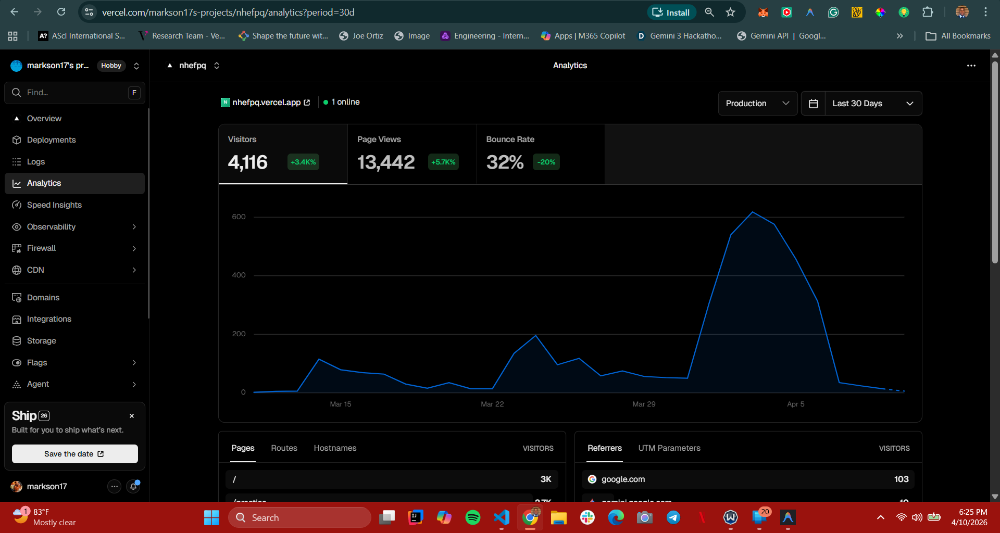

# NHEF-PQ: The Ultimate Assessment Preparation Platform

**NHEF-PQ** is a high-performance web application designed to help candidates navigate the Nigeria Higher Education Foundation (NHEF) scholars program selection process.

The project is live and accessible at [https://nhefpq.vercel.app/](https://nhefpq.vercel.app/).

## The Story
I built this app while preparing for the NHEF program myself. During my preparation, I noticed most candidates were relying on static PDFs and printed papers, which didn't reflect the time-pressured nature of the actual test. I decided to build a better tool to help myself prepare—and it worked! I was selected as an NHEF Scholar, and now this tool exists to help the next generation of applicants.

## Key Features

### Timed Practice Mode
The core of the platform. While many candidates know the material, the clock is often the biggest hurdle. This mode simulates real exam conditions, helping users refine their speed and accuracy before the big day.

### Categorized Question Bank
Drill specific areas without sitting through a full test. The bank is broken down into **Numerical** and **Verbal** categories, allowing for focused practice on the topics that need the most attention.

### Interview Preparation
The written test is only the first hurdle. Many candidates don't start thinking about the interview stage until it's almost too late. This section provides:
- **Strategic Frameworks**: Deep dives into the STAR (Situation, Task, Action, Result) method.
- **Sample Questions**: Real-world examples tied directly to the NHEF evaluation criteria.

### Built-in Bug Reporting
Standardized test content from past papers often contains errors. To keep the question bank accurate without requiring manual audits of every single item, I integrated a bug reporting system. Users can flag errors in context, allowing the community to keep the resource refined and reliable.

## Tech Stack
- **Framework**: [Next.js 15](https://nextjs.org/) (App Router)
- **Language**: TypeScript
- **Database**: MongoDB via [Mongoose](https://mongoosejs.com/)
- **Storage**: [Vercel Blob](https://vercel.com/storage/blob) for study materials and media
- **Analytics**: [Vercel Analytics](./public/analytics.png) for performance monitoring and usage tracking
- **Styling**: Tailwind CSS (with Glassmorphism aesthetic)

---

## Usage & Impact

Since its launch, NHEF-PQ has seen significant engagement from candidates across Nigeria, with over **4,100 unique visitors** and more than **13,000 page views**, helping thousands prepare for their futures.

---

## Learn More

To learn more about the **[Nigeria Higher Education Foundation (NHEF) scholars program](https://thenhef.org/applications-now-open-for-the-2026-nhef-scholars-program/)**, visit their official website.
